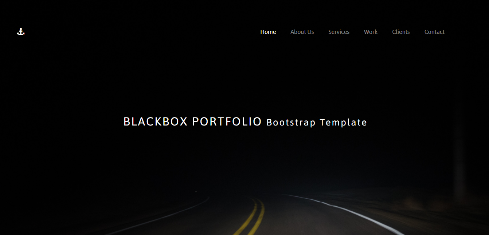
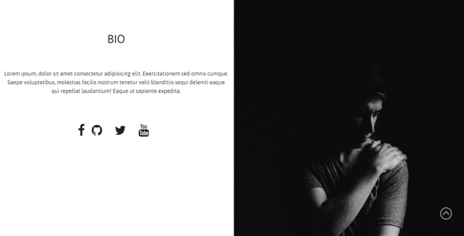

# Bootstrap4 Portfolio Template

BlackBox Bootstrap Portfolio Template is a responsive, one page portfolio [Bootstrap4](http://getbootstrap.com/) theme developed by [vishal](https://github.com/vishalj95).

## Preview

[DEMO](https://vishalj95.github.io/bootstrap-portfolio/)

## Usage

### Basic Usage

After cloning/downloading, simply edit the HTML and CSS files included with the template in your favorite text editor to make changes. These are the only files you need to worry about, you can ignore everything else! To preview the changes you make to the code, you can open the `index.html` file in your web browser.

## About

BlackBox Portfolio Bootstrap Template is an open source free Bootstrap templates.Template is under the MIT license, which means you can use them for any purpose, even for commercial projects.

## License

Code released under the [MIT](https://github.com/BlackrockDigital/startbootstrap-stylish-portfolio/blob/gh-pages/LICENSE) license.

